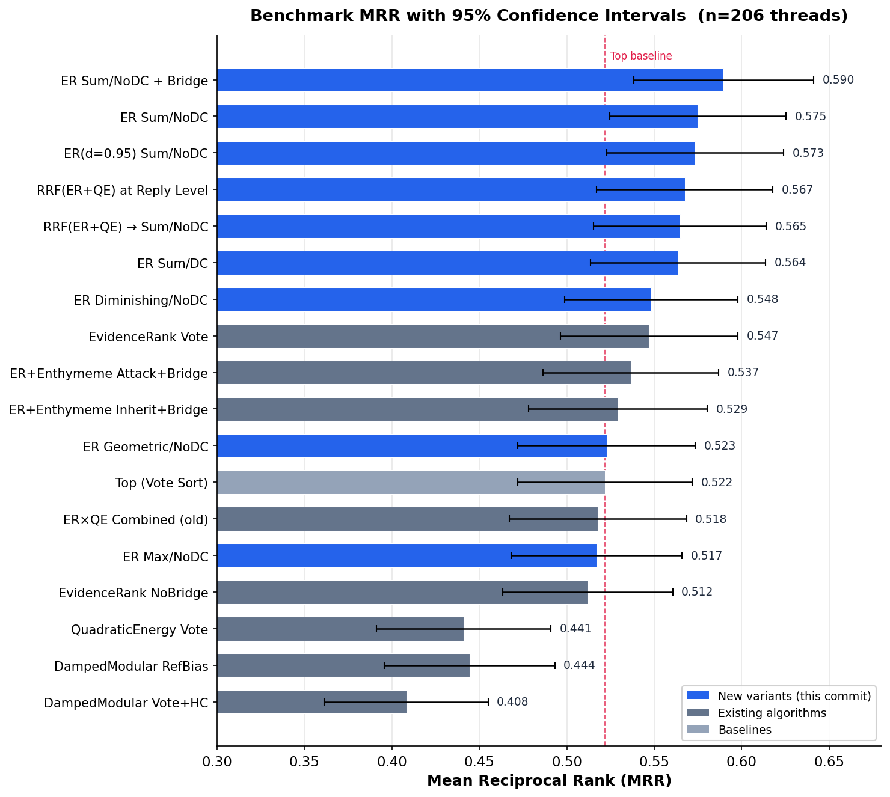

# Benchmark Results — 2026-03-10 (Aggregation & RRF Quick Wins)

## Setup

- **Dataset**: webis-cmv-20 (Reddit r/ChangeMyView)
- **Task**: Rank delta-awarded replies highest
- **Threads evaluated**: 206
- **Metrics**: MRR (Mean Reciprocal Rank), bootstrap p-value and 95% CI vs Top_Flat baseline
- **New this run**: Parameterized aggregation (Sum/Diminishing/Geometric), degree centrality ablation (NoDC), Reciprocal Rank Fusion (RRF)

## Results (sorted by MRR)

| Algorithm | MRR | ±std | p-value | 95% CI ΔMRR |
|---|---|---|---|---|
| **ER_Vote_Sum_NoDC_Bridge** | **0.590** | 0.377 | **0.0003** | [+0.028, +0.106] |
| **ER_Vote_Sum_NoDC** | **0.575** | 0.370 | **0.0005** | [+0.023, +0.084] |
| **ER_Vote_D95_Sum_NoDC** | **0.573** | 0.371 | **0.0008** | [+0.021, +0.082] |
| **RRF_ER_QE_Reply** | **0.567** | 0.370 | **0.023** | [+0.006, +0.085] |
| RRF_ER_QE_Vote | 0.565 | 0.362 | 0.078 | [-0.005, +0.090] |
| ER_Vote_Sum | 0.564 | 0.366 | 0.007 | [+0.012, +0.072] |
| ER_Vote_Dim_NoDC | 0.548 | 0.363 | 0.087 | [-0.004, +0.057] |
| EvidenceRank_Vote_D95 | 0.548 | 0.371 | 0.188 | [-0.012, +0.065] |
| EvidenceRank_Vote | 0.547 | 0.372 | 0.202 | [-0.013, +0.063] |
| ER_Enth_Attack_Bridge | 0.537 | 0.368 | 0.438 | [-0.022, +0.052] |
| ER_Enth_Inherit_Bridge | 0.529 | 0.374 | 0.725 | [-0.033, +0.048] |
| ER_Vote_Geo_NoDC | 0.523 | 0.371 | 0.956 | [-0.030, +0.030] |
| **Top_Flat (baseline)** | **0.522** | 0.365 | — | — |
| Combined_ER_QE_Vote | 0.518 | 0.371 | 0.848 | [-0.045, +0.037] |
| ER_Vote_NoDC | 0.517 | 0.357 | 0.791 | [-0.040, +0.030] |
| EvidenceRank_Vote_NoBridge | 0.512 | 0.356 | 0.564 | [-0.045, +0.024] |
| QuadraticEnergy_Vote | 0.441 | 0.365 | 0.002 | [-0.131, -0.030] |
| DampedModular_RefBias_NoBridge | 0.444 | 0.357 | 0.0003 | [-0.119, -0.036] |
| DampedModular_Vote_HC_NoBridge | 0.408 | 0.343 | 0.0001 | [-0.161, -0.066] |

## Key Findings

### 1. Sum aggregation is the primary driver (+0.053 MRR)

Switching from **max** to **sum** when aggregating i-node scores per reply is the single biggest improvement. Delta-awarded replies generate more extractable claims (i-nodes) on average. Max aggregation discards this multiplicity signal — it treats a 5-claim reply identically to a 1-claim reply if their best claims tie. Sum aggregation captures *total argumentative contribution*.

### 2. Removing degree centrality eliminates noise (+0.008 MRR)

The DC multiplier `score × log(1 + dc)` was intended to boost structurally important "hub" nodes. In practice, ~83% of i-nodes are leaves with dc=1, receiving a uniform `log(2) ≈ 0.693` penalty. This adds noise rather than signal. Removing it (NoDC) consistently improves results.

### 3. Bridge coefficient captures multi-facet persuasion (+0.015 MRR)

Replies that address multiple distinct i-nodes from the OP get a score boost: `score × (1 + bridgeCoeff × (uniqueTargets - 1))`. This rewards replies that "bridge" across different parts of the OP's argument structure — a hallmark of effective persuasion in CMV.

### 4. RRF is robust but not dominant

Reciprocal Rank Fusion of EvidenceRank + QuadraticEnergy at reply level (0.567) is significant (p=0.023), but the simpler Sum/NoDC+Bridge (0.590) outperforms it. The small-sample advantage of RRF_ER_QE_Vote at n=20 (0.737 MRR) did not hold at n=206 — it was partly overfitted to the sample.

### 5. EvidenceRank_Vote is not significant at scale

The previous best algorithm (0.547 MRR) does not significantly beat the Top baseline (p=0.20) at n=206. The graph analysis layer adds modest value on its own — the aggregation strategy matters more.

## New Algorithms

### aggregateToReplyLevelV2

Parameterized aggregation with two new dimensions:

- **AggMode**: `max` (original) | `sum` | `diminishing` (max + 0.3×rest) | `geometric` (geometric mean)
- **DCMode**: `full` (original: score × log(1+dc)) | `none` (raw score) | `soft` (score × (1 + 0.1×log(1+dc)))

### rrfCombine (Reciprocal Rank Fusion)

Fuses multiple ranked lists using `score(item) = Σ 1/(k + rank_i)` with k=60. Distribution-free, robust to score scale differences between rankers.

## Best Algorithm: ER_Vote_Sum_NoDC_Bridge

1. Run EvidenceRank with vote-weighted basic strength on the i-node graph
2. Aggregate to reply level using **sum** of all i-node scores (no degree centrality)
3. Apply **bridge multiplier** for replies targeting multiple OP claims
4. MRR = 0.590, +0.068 over Top baseline (p=0.0003)
